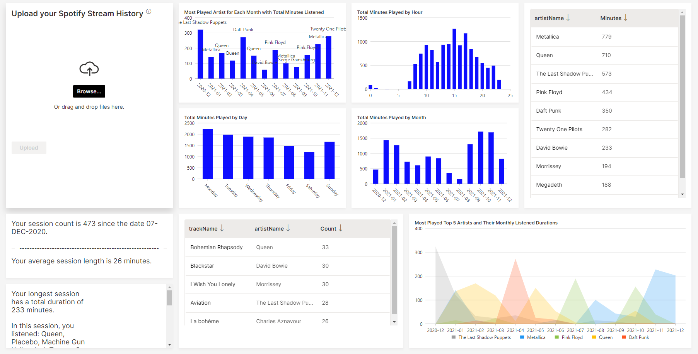

# SpotifyWaveApp

This app is created with H2O.ai Wave app. H2O Wave is an open-source Python development framework that makes it fast and easy for data scientists, machine learning engineers, and software developers to develop real-time interactive AI apps with sophisticated visualizations. H2O Wave accelerates development with a wide variety of user-interface components and charts, including dashboard templates, dialogs, themes, widgets, and many more.

To run the app succesfully, firstly, user stream history must be download from the Spotify account. Then the stream history data should be uploaded and submmitted in the app interface to see the data visualisations and the result analysis. 


## Running this App Locally

### System Requirements

1. Python 3.6+
2. pip3

### 1. Run the Wave Server

You can easily use [the documentation](https://wave.h2o.ai/docs/installation) and set up the Wave Server on your local machine. 

Once the server is up and running you can easily use any Wave app.

### 2. Setup Your Python Environment

You can create virtual environments with other tools too.  These code samples are for Windows. 
```bash
git clone https://github.com/semihdesticioglu/SpotifyWaveApp
cd SpotifyWaveApp
conda create --name h2o_wave
activate h2o_wave
pip install -r requirements.txt
```

### 3. Run the App

```bash
 wave run spotify_app
```

### 4. View the App

Point your favorite web browser to [localhost:10101/spotify](http://localhost:10101/spotify)


